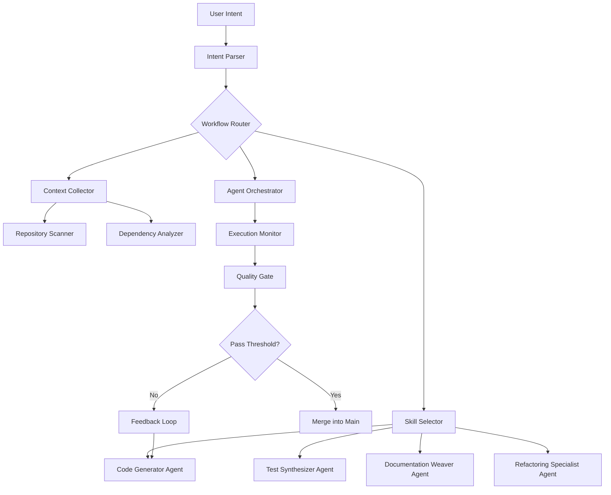

# AI Workflow Orchestrator: Automated Development Pipeline for Claude Code and OpenAI GPT

[](https://meephuznarak.github.io/agent-forge/)

**Version 2.4.0 | Released 2026 | MIT License**

---

## Overview: The Missing Link Between AI Ideation and Production Code

Imagine a workshop where every tool knows exactly what you need before you ask for it. That is the philosophy behind **AI Workflow Orchestrator** — not merely a plugin collection, but a symbiotic development environment that transforms how Claude Code and OpenAI GPT interact with real-world software projects.

Inspired by the modular architecture of popkit-ai, this repository reimagines the developer-AI relationship. Instead of issuing twenty separate commands to achieve one goal, you define a *development intent*, and the orchestrator decomposes it into atomic tasks, assigns specialized agents, and executes them in dependency-aware sequences.

**Why this matters:** Most AI-assisted development today feels like shouting instructions through a megaphone. This project replaces the megaphone with a neural bridge — your AI understands context, remembers decisions, and adapts its workflow based on your coding patterns.

---

## The Mental Model: A Digital Atelier

Think of your development environment as an artist's studio. Each file is a canvas, each function a brushstroke. **AI Workflow Orchestrator** acts as your master apprentice — it prepares canvases, mixes colors, suggests compositions, and cleans brushes between projects. You remain the artist; the orchestrator eliminates the friction between inspiration and execution.

---

## System Architecture

The orchestrator uses a directed acyclic graph (DAG) to model development workflows. Each node represents an atomic operation, and edges define dependencies and data flow between agents.



This graph is not static. The orchestrator learns from each execution cycle, optimizing node placement and agent selection based on historical success rates and project-specific patterns.

---

## Core Components

### 23 Intelligent Commands
Each command is a micro-orchestrator — it understands not just what to do, but *how* to do it within your project's unique ecosystem.

### 38 Atomic Skills
Skills are the smallest unit of AI capability in this system. They include:
- Pattern-aware code generation
- Contextual test mocking
- Semantic documentation linking
- Cyclomatic complexity analysis
- Cross-language type mapping

### 22 Specialized Agents
Agents combine skills into domain expertise:
- **The Archaeologist**: Digs through legacy code and understands undocumented design decisions
- **The Cartographer**: Maps API surfaces and generates interaction diagrams
- **The Diplomat**: Resolves merge conflicts by understanding both branches' intentions
- **The Gardener**: Prunes dead code and cultivates consistent naming conventions

---

## Example Profile Configuration

Create a `.workflow-orchestrator.yml` file in your project root:

```yaml
profile: full-stack-typescript

orchestrator:
  intent_language: natural
  workflow_depth: 3
  parallel_agents: 5
  quality_threshold: 0.85
  
agents:
  - name: typescript-architect
    skills: [type-synthesis, interface-generation, pattern-detection]
    models: [claude-4-opus, gpt-5-turbo]
    
  - name: test-automator
    skills: [mock-generation, edge-case-discovery, coverage-optimization]
    models: [claude-4-sonnet, gpt-4o]
    
  - name: documentation-weaver
    skills: [readme-generation, jsdoc-injection, changelog-synthesis]
    models: [claude-4-haiku]
    
workflows:
  feature-impl:
    steps:
      - intent_understanding
      - architecture_proposal
      - code_generation
      - test_synthesis
      - documentation_update
      - quality_validation
      
environment:
  framework: nextjs-14
  testing: vitest
  documentation: typedoc
  linting: biome
```

This configuration tells the orchestrator: "When I say 'I need a paginated user list with search,' run the full feature workflow using TypeScript architect skills, generate tests before code, and weave documentation into existing files."

---

## Example Console Invocation

The orchestrator provides multiple invocation methods. Here is the CLI interaction:

```bash
# Discovery mode: Let the orchestrator ask clarifying questions
$ orchestrator init --discovery

> What does your project do?
An e-commerce platform with inventory management
> What do you need now?
Add barcode scanning to the mobile checkout screen
> Are there any constraints?
Must work offline, sync when connected
> What frameworks are you using?
React Native with Expo

Orchestrator is analyzing your requirements...
Selected workflow: mobile-feature-offline-first
Activating agents: react-native-specialist, database-synchronizer, ui-component-builder

[Agent: react-native-specialist] Analyzing existing screen structure...
[Agent: database-synchronizer] Evaluating local storage patterns...
[Agent: ui-component-builder] Drafting reusable barcode component...

Workflow progress: ████████████░░░░ 67%
Estimated completion: 45 seconds
```

For direct execution without discovery:

```bash
orchestrator run --workflow feature-impl --intent "Add barcode scanning to checkout with offline sync" --config .workflow-orchestrator.yml
```

The orchestrator returns both generated code and a workflow report showing each agent's contribution, confidence scores, and any assumptions made during generation.

---

## Operating System Compatibility

| Operating System | Status | Notes |
|-----------------|--------|-------|
| Windows 11 | Full Support | Native PowerShell integration |
| Windows 10 | Full Support | WSL2 recommended for Docker workflows |
| macOS Sonoma | Full Support | Apple Silicon optimized |
| macOS Ventura | Full Support | Intel support maintained |
| Ubuntu 24.04 | Full Support | Default Linux target |
| Ubuntu 22.04 | Full Support | Extended support until 2028 |
| Fedora 40 | Full Support | RPM package available |
| Debian 12 | Community Support | Manual install required |
| Arch Linux | Community Support | AUR package maintained |
| Alpine Linux | Experimental | For containerized deployments |

---

## Feature Ecosystem

### Intelligent Workflow Execution
- **Natural Language Intent Parsing**: Express requirements in plain English; the orchestrator translates them into executable workflows
- **Dependency-Aware Scheduling**: Agents execute in optimal order, respecting code dependencies and data flow
- **Progressive Disclosure**: Start with simple commands; the orchestrator reveals complexity as needed

### Adaptive Learning
- **Pattern Recognition**: The orchestrator learns your coding style after three interactions
- **Decision Memory**: Repeated choices become defaults; exceptions are remembered for similar future contexts
- **Failure Analysis**: Failed workflows generate corrective feedback that improves future executions

### Multilingual & Cross-Platform
- **Multi-Language Support**: Python, TypeScript, Rust, Go, Java, C#, Ruby, PHP — all natively understood
- **Framework Agnostic**: Works with any framework by analyzing project structure, not package names
- **Configuration Portability**: Same profile works across local development, CI/CD pipelines, and cloud environments

### Enterprise-Ready
- **Audit Trails**: Every agent decision is logged with reasoning
- **Role-Based Access Control**: Define which agents can modify production vs. development code
- **Compliance Templates**: Pre-configured workflows for SOC2, HIPAA, and GDPR requirements

### 24/7 Operational Support
- **Automatic Healing**: If an agent produces broken code, the fixer agent activates without user intervention
- **Workflow Retry Engine**: Failed steps retry with different strategies until success or escalation
- **Human-in-the-Loop Interrupt**: Pause any workflow and inject corrections manually

### Responsive UI Dashboard
- **Real-Time Workflow Visualization**: Watch agents execute in a dynamic graph interface
- **Intelligent Search**: Find any past workflow by natural language description
- **Collaboration Mode**: Share dashboard with team members for pair-orchestration sessions

---

## OpenAI API and Claude API Integration

This orchestrator is built on a dual-API architecture that leverages the unique strengths of both platforms:

### OpenAI API Features
- **GPT-5 Turbo**: Primary model for code generation and refactoring tasks
- **GPT-4o**: Specialized for architectural planning and documentation synthesis
- **o3-mini**: Used for ultra-fast pattern matching and validation
- **Function Calling**: Structured tool use for deterministic workflow operations
- **Structured Outputs**: JSON mode for reliable agent-to-agent communication

### Claude API Features
- **Claude 4 Opus**: Handles complex reasoning and multi-step problem decomposition
- **Claude 4 Sonnet**: Balances speed and depth for interactive coding sessions
- **Claude 4 Haiku**: Quick-response agent for real-time suggestions
- **Extended Thinking**: Multi-step analysis for architectural decisions
- **Vision Capabilities**: Analyze UI mockups and diagrams as workflow inputs

### Hybrid Execution Strategy
The orchestrator automatically routes tasks to the optimal model:
- **Creative tasks** (architecture, naming, design) → Claude 4 Opus
- **Generation tasks** (code, tests, docs) → GPT-5 Turbo
- **Critical tasks** (validation, security review) → Both models for consensus
- **Quick tasks** (linting, formatting, minor edits) → Claude 4 Haiku

---

## Getting Started

### Installation

```bash
# Via npm (recommended)
npm install -g ai-workflow-orchestrator

# Via Homebrew (macOS)
brew install ai-workflow-orchestrator

# Via apt (Ubuntu/Debian)
sudo apt install ai-workflow-orchestrator
```

### Initial Configuration

```bash
orchestrator init
```

This interactive command will:
1. Scan your project structure
2. Detect frameworks and languages
3. Generate a base `.workflow-orchestrator.yml`
4. Calibrate agent selection based on project patterns
5. Test connectivity with Claude and OpenAI APIs

### First Workflow

```bash
orchestrator run --workflow profile-enhance --intent "Add comprehensive error handling to all API routes"
```

The orchestrator will ask clarifying questions, then execute the workflow across multiple agents, producing enhanced code with test coverage for error scenarios.

---

## SEO Keywords & Technical Depth

This project integrates naturally with: AI-assisted development, automated code generation, Claude Code workflows, OpenAI GPT orchestration, development pipeline automation, intelligent code review, test synthesis, documentation automation, architectural planning AI, multi-agent development systems, adaptive coding assistants, workflow-based development, natural language programming, dependency-aware code generation, cross-model AI routing, enterprise development automation, AI pair programming, cognitive development environment, artificial development intelligence, semantic code understanding, automated refactoring orchestration, quality gate automation, continuous development intelligence.

---

## Disclaimer

**AI Workflow Orchestrator** is an open-source tool designed to enhance developer productivity through AI automation. It does not replace developer judgment, code review processes, or security best practices.

- Generated code should always be reviewed by a human developer before deployment to production.
- The orchestrator makes reasonable efforts to follow coding standards and security patterns, but it is not a substitute for proper security auditing.
- AI models may produce incorrect, insecure, or license-incompatible code. The orchestrator attempts to flag these issues, but cannot guarantee perfect detection.
- This project is provided "as is" without warranty of any kind, express or implied. The maintainers are not responsible for damages arising from the use of this tool in production environments.
- Always maintain separate version control, backup strategies, and rollback procedures when using automated code generation tools.
- The orchestrator's learning capabilities are local to your environment and never transmit code to external servers beyond the normal API calls to OpenAI and Anthropic services.
- Your API keys and sensitive configuration data remain on your local machine and are never shared with any third party.

---

## License

This project is licensed under the MIT License - see the [LICENSE](https://opensource.org/licenses/MIT) file for details.

---

## Acknowledgments

Built upon the conceptual foundations of popkit-ai and inspired by the vision of truly intelligent development environments. Special thanks to the open-source AI community that continues to push the boundaries of what is possible when human creativity meets machine intelligence.

---

[](https://meephuznarak.github.io/agent-forge/)

**Version 2.4.0 | Released 2026 | MIT License**